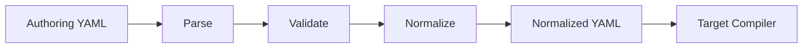

# ffcraft

`ffcraft` is the project and module behind the `ffcompile` and `ffcodegen` commands. It helps teams author reusable feature flag definitions, validate them early, and generate consistent runtime config and typed code for supported targets.

This repository has two main entrypoints:

- `ffcompile`: parse, validate, normalize, and compile authoring YAML into consistent runtime configuration
- `ffcodegen`: generate application-facing typed code from the same authoring YAML

The pipeline is:



## Scope

Supported today:

- authoring format `v1`
- normalized YAML as an intermediate representation
- compiler targets: `flagd`, `gofeatureflag`
- reusable `variant_sets`, `rules`, and `distributions`
- per-environment `serve`, `rules`, and `default_action`
- `scheduled_rollouts`
- `progressive_rollout`
- `experimentation`
- comparison, logical, collection, string, and semver operators

Current limitations:

- `matches` parses and validates, but does not compile for `flagd` or `gofeatureflag`
- YAML aliases and anchors are not supported
- top-level environment `experimentation` is not compiled for `flagd`

## Install

```bash
go install github.com/satorunooshie/ffcraft/cmd/ffcompile@latest
go install github.com/satorunooshie/ffcraft/cmd/ffcodegen@latest
```

The canonical schema lives in [proto/ffcraft/v1/ffcraft.proto](proto/ffcraft/v1/ffcraft.proto). A JSON Schema for editor and tooling integration lives in [schema/developer-flags.schema.json](schema/developer-flags.schema.json). Generated Go code lives in [gen/ffcraft/v1/ffcompile.pb.go](gen/ffcraft/v1/ffcompile.pb.go).

## Documentation

- [docs/authoring-format.md](docs/authoring-format.md): authoring YAML syntax and semantics
- [docs/compiler-targets.md](docs/compiler-targets.md): how compiled output differs between `flagd` and `gofeatureflag`
- [docs/ffcodegen.md](docs/ffcodegen.md): `ffcodegen` commands, defaults, `ffcodegen.yaml`, and generated API usage

## Quick Start

Smallest end-to-end example:

```yaml
# ffcompile.yaml
version: v1

variant_sets:
  boolean:
    on: true
    off: false

flags:
  - key: enable-new-home
    variant_set: boolean
    default_variant: off
    environments:
      prod:
        default_action:
          serve: on
```

```bash
go run ./cmd/ffcompile build flagd --in ffcompile.yaml --env prod --out prod.flagd.json
go run ./cmd/ffcodegen go --in ffcompile.yaml --out featureflags_gen.go
```

```go
evaluator := featureflags.New(client)
enabled, err := evaluator.EnableNewHome(ctx)
```

`client` is the generated SDK-agnostic evaluator client interface. In practice, applications are expected to implement that interface in their infra layer, often as a thin adapter over OpenFeature or another flag runtime.

Compile runtime config for `flagd`:

```bash
go run ./cmd/ffcompile build flagd --in flags.yaml --env prod --out flagd.json
```

Compile runtime config for `GO Feature Flag`:

```bash
go run ./cmd/ffcompile build gofeatureflag --in flags.yaml --env prod --out flags.goff.yaml
```

Generate typed Go accessors:

```bash
go run ./cmd/ffcompile build flagd --in ffcompile.yaml --env prod --out prod.flagd.json
go run ./cmd/ffcodegen go --in ffcompile.yaml --config ffcodegen.yaml --out featureflags_gen.go
```

For `ffcodegen` usage, defaults, and `ffcodegen.yaml` settings, see [docs/ffcodegen.md](docs/ffcodegen.md).

## Compile Config

Build `flagd` JSON from authoring YAML:

```bash
go run ./cmd/ffcompile build flagd --in flags.yaml --env prod --out flagd.json
```

Build `GO Feature Flag` YAML from authoring YAML:

```bash
go run ./cmd/ffcompile build gofeatureflag --in flags.yaml --env prod --out flags.goff.yaml
```

Normalize first, then compile explicitly:

```bash
go run ./cmd/ffcompile normalize --in flags.yaml --out normalized.yaml
go run ./cmd/ffcompile compile flagd --in normalized.yaml --env prod --out flagd.json
go run ./cmd/ffcompile compile gofeatureflag --in normalized.yaml --env prod --out flags.goff.yaml
```

Inspect the normalized intermediate form while building:

```bash
go run ./cmd/ffcompile build flagd --in flags.yaml --env prod --dump -
go run ./cmd/ffcompile build gofeatureflag --in flags.yaml --env prod --dump normalized.yaml
```

Skip flags that do not define the requested environment:

```bash
go run ./cmd/ffcompile build flagd --in flags.yaml --env prod --allow-missing-env
```

## Commands

- `build flagd`: parse, validate, normalize, and compile to `flagd` JSON
- `build gofeatureflag`: parse, validate, normalize, and compile to `GO Feature Flag` YAML
- `normalize`: parse, validate, and emit normalized YAML
- `compile flagd`: compile normalized YAML to `flagd` JSON
- `compile gofeatureflag`: compile normalized YAML to `GO Feature Flag` YAML

## Code Generation

`ffcodegen` consumes authoring YAML or normalized YAML and emits application-linked generated code. The initial target is typed Go accessors over a small evaluator interface.

The generated Go code is intentionally runtime-SDK agnostic. It emits typed accessors plus a small `Client` interface and `EvaluationContext` type; consumer applications wire those to OpenFeature or another SDK through an adapter they own.

```bash
go run ./cmd/ffcodegen go --in ffcompile.yaml --config ffcodegen.yaml --out featureflags_gen.go
go run ./cmd/ffcodegen go --in ffcompile.yaml
```

See [docs/ffcodegen.md](docs/ffcodegen.md) for configuration and usage details.

## Authoring Example

```yaml
version: v1

variant_sets:
  boolean:
    on: true
    off: false

rules:
  internal_ios:
    all_of:
      - eq:
          - { var: user.type }
          - internal
      - eq:
          - { var: device.platform }
          - ios

flags:
  - key: enable-new-home
    variant_set: boolean
    default_variant: off
    environments:
      prod:
        rules:
          - if:
              rule: internal_ios
            serve: on
        default_action:
          serve: off
```

Compiled `flagd` output:

```json
{
  "$schema": "https://flagd.dev/schema/v0/flags.json",
  "flags": {
    "enable-new-home": {
      "state": "ENABLED",
      "variants": {
        "off": false,
        "on": true
      },
      "defaultVariant": "off",
      "targeting": {
        "if": [
          {
            "and": [
              {
                "==": [
                  {
                    "var": "user.type"
                  },
                  "internal"
                ]
              },
              {
                "==": [
                  {
                    "var": "device.platform"
                  },
                  "ios"
                ]
              }
            ]
          },
          "on",
          "off"
        ]
      }
    }
  }
}
```

Compiled `GO Feature Flag` output:

```yaml
enable-new-home:
  variations:
    off: false
    on: true
  defaultRule:
    variation: off
  targeting:
    - query: (user.type eq "internal") AND (device.platform eq "ios")
      variation: on
```

## Compiler Targets

`ffcompile` has one authoring model, but the compiled semantics are not identical across targets. The practical differences are:

| Capability | `flagd` | `gofeatureflag` |
| --- | --- | --- |
| Fixed serve | native | native |
| Percentage rollout | `fractional` targeting | native `percentage` |
| Progressive rollout | expanded at compile time into time-based steps | native `progressiveRollout` |
| Scheduled rollout | compiled into timestamp-ordered `if` chain | native `scheduledRollout` |
| Step experimentation | temporary overlay during `start <= now < end` | compiled to native rollout fields, not overlay-identical |
| Top-level environment experimentation | not supported | native `experimentation` |
| Mixed stickiness in one flag | allowed per action | rejected because `bucketingKey` is flag-scoped |

For the full target notes, see [docs/compiler-targets.md](docs/compiler-targets.md).

## Samples

Canonical paired examples use one authoring file and show both target outputs side by side:

- `basic`
  - [examples/basic/ffcompile.yaml](examples/basic/ffcompile.yaml)
  - [examples/basic/prod.flagd.json](examples/basic/prod.flagd.json)
  - [examples/basic/prod.goff.yaml](examples/basic/prod.goff.yaml)
- `rule-targeting`
  - [examples/rule-targeting/ffcompile.yaml](examples/rule-targeting/ffcompile.yaml)
  - [examples/rule-targeting/prod.flagd.json](examples/rule-targeting/prod.flagd.json)
  - [examples/rule-targeting/prod.goff.yaml](examples/rule-targeting/prod.goff.yaml)
- `scheduled-rollouts`
  - [examples/scheduled-rollouts/ffcompile.yaml](examples/scheduled-rollouts/ffcompile.yaml)
  - [examples/scheduled-rollouts/prod.flagd.json](examples/scheduled-rollouts/prod.flagd.json)
  - [examples/scheduled-rollouts/prod.goff.yaml](examples/scheduled-rollouts/prod.goff.yaml)
- `progressive-rollouts`
  - [examples/progressive-rollouts/ffcompile.yaml](examples/progressive-rollouts/ffcompile.yaml)
  - [examples/progressive-rollouts/prod.flagd.json](examples/progressive-rollouts/prod.flagd.json)
  - [examples/progressive-rollouts/prod.goff.yaml](examples/progressive-rollouts/prod.goff.yaml)
- `experimentation-rollouts`
  - [examples/experimentation-rollouts/ffcompile.yaml](examples/experimentation-rollouts/ffcompile.yaml)
  - [examples/experimentation-rollouts/prod.flagd.json](examples/experimentation-rollouts/prod.flagd.json)
  - [examples/experimentation-rollouts/prod.goff.yaml](examples/experimentation-rollouts/prod.goff.yaml)
- `go-codegen`
  - `adapter implementation`
  - [examples/go-codegen/adapter/adapter.go](examples/go-codegen/adapter/adapter.go)
  - [examples/go-codegen/README.md](examples/go-codegen/README.md)
  - `config and generated code`
  - [examples/go-codegen/basic/ffcompile.yaml](examples/go-codegen/basic/ffcompile.yaml)
  - [examples/go-codegen/basic/ffcodegen.yaml](examples/go-codegen/basic/ffcodegen.yaml)
  - [examples/go-codegen/basic/gen/featureflags_gen.go](examples/go-codegen/basic/gen/featureflags_gen.go)
  - [examples/go-codegen/rollout/ffcompile.yaml](examples/go-codegen/rollout/ffcompile.yaml)
  - [examples/go-codegen/rollout/ffcodegen.yaml](examples/go-codegen/rollout/ffcodegen.yaml)
  - [examples/go-codegen/withhooks/ffcompile.yaml](examples/go-codegen/withhooks/ffcompile.yaml)
  - [examples/go-codegen/withhooks/ffcodegen.yaml](examples/go-codegen/withhooks/ffcodegen.yaml)
  - [examples/go-codegen/rollout/gen/featureflags_gen.go](examples/go-codegen/rollout/gen/featureflags_gen.go)
  - [examples/go-codegen/withhooks/gen/featureflags_gen.go](examples/go-codegen/withhooks/gen/featureflags_gen.go)
  - `flagd runtime examples`
  - [examples/go-codegen/basic/flagd/main.go](examples/go-codegen/basic/flagd/main.go)
  - [examples/go-codegen/rollout/flagd/main.go](examples/go-codegen/rollout/flagd/main.go)
  - [examples/go-codegen/withhooks/flagd/main.go](examples/go-codegen/withhooks/flagd/main.go)
  - `gofeatureflag runtime examples`
  - [examples/go-codegen/basic/gofeatureflag/main.go](examples/go-codegen/basic/gofeatureflag/main.go)
  - [examples/go-codegen/rollout/gofeatureflag/main.go](examples/go-codegen/rollout/gofeatureflag/main.go)
  - [examples/go-codegen/withhooks/gofeatureflag/main.go](examples/go-codegen/withhooks/gofeatureflag/main.go)

Generate the sample outputs.

Canonical examples:

```bash
go run ./cmd/ffcompile build flagd --in examples/basic/ffcompile.yaml --env prod --out examples/basic/prod.flagd.json
go run ./cmd/ffcompile build gofeatureflag --in examples/basic/ffcompile.yaml --env prod --out examples/basic/prod.goff.yaml
go run ./cmd/ffcompile build flagd --in examples/rule-targeting/ffcompile.yaml --env prod --out examples/rule-targeting/prod.flagd.json
go run ./cmd/ffcompile build gofeatureflag --in examples/rule-targeting/ffcompile.yaml --env prod --out examples/rule-targeting/prod.goff.yaml
go run ./cmd/ffcompile build flagd --in examples/scheduled-rollouts/ffcompile.yaml --env prod --out examples/scheduled-rollouts/prod.flagd.json
go run ./cmd/ffcompile build gofeatureflag --in examples/scheduled-rollouts/ffcompile.yaml --env prod --out examples/scheduled-rollouts/prod.goff.yaml
go run ./cmd/ffcompile build flagd --in examples/progressive-rollouts/ffcompile.yaml --env prod --out examples/progressive-rollouts/prod.flagd.json
go run ./cmd/ffcompile build gofeatureflag --in examples/progressive-rollouts/ffcompile.yaml --env prod --out examples/progressive-rollouts/prod.goff.yaml
go run ./cmd/ffcompile build flagd --in examples/experimentation-rollouts/ffcompile.yaml --env prod --out examples/experimentation-rollouts/prod.flagd.json
go run ./cmd/ffcompile build gofeatureflag --in examples/experimentation-rollouts/ffcompile.yaml --env prod --out examples/experimentation-rollouts/prod.goff.yaml
```

Go codegen examples:

```bash
make update-go-example
```

## Docs

- [docs/authoring-format.md](docs/authoring-format.md): authoring schema and evaluation model
- [docs/compiler-targets.md](docs/compiler-targets.md): target-specific compilation behavior and gaps
- [schema/README.md](schema/README.md): JSON Schema and schema-directory notes

Reference fixtures:

- [internal/flagd/testdata/example.yaml](internal/flagd/testdata/example.yaml)
- [internal/flagd/testdata/prod.golden.json](internal/flagd/testdata/prod.golden.json)
- [internal/gofeatureflag/testdata/example.yaml](internal/gofeatureflag/testdata/example.yaml)
- [internal/gofeatureflag/testdata/prod.golden.yaml](internal/gofeatureflag/testdata/prod.golden.yaml)
