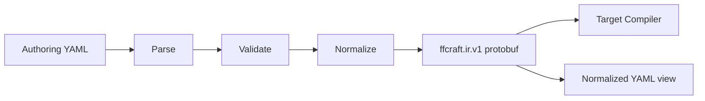

# ffcraft

`ffcraft` is the project and module behind the `ffcompile` and `ffcodegen` commands. It helps teams author reusable feature flag definitions, validate them early, and generate consistent runtime config and typed code for supported targets.

This repository has two main entrypoints:

- `ffcompile`: normalize authoring YAML into the public protobuf IR and compile it into consistent runtime configuration
- `ffcodegen`: generate application-facing typed code from authoring YAML or the public protobuf IR

The pipeline is:


```mermaid
flowchart LR
    A[Authoring YAML] --> B[Parse]
    B --> C[Validate]
    C --> D[Normalize]
    D --> E[ffcraft.ir.v1 protobuf]
    E --> F[Target Compiler]
    E --> G[Normalized YAML view]
```

The semantic contract between normalization and compilers is the protobuf IR
defined in [proto/ffcraft/ir/v1/normalized.proto](proto/ffcraft/ir/v1/normalized.proto).
Normalized YAML is a deterministic adapter for that IR. Opaque extensions are
preserved at document, flag, and environment scope; core compilers ignore them
and external generators may consume the namespaces they own. See
[docs/extension-spec.md](docs/extension-spec.md) for the complete contract.
Core transport limits are 256 extension namespaces per scope, 256 members per
object/list, nesting depth 64, and 1 MiB protobuf payload per namespace;
namespace contents remain opaque to core validation.

## Scope

Supported today:

- authoring format `v1`
- normalized YAML as a deterministic human-readable view of the protobuf IR
- compiler targets: `flagd`, `gofeatureflag`
- reusable `variant_sets`, `rules`, and `distributions`
- per-environment `serve`, `rules`, and `default_action`
- `scheduled_rollouts`
- `progressive_rollout`
- comparison, logical, collection, string, and semver operators

Current limitations:

- YAML aliases and anchors are not supported

## Install

```bash
go install github.com/satorunooshie/ffcraft/cmd/ffcompile@latest
go install github.com/satorunooshie/ffcraft/cmd/ffcodegen@latest
```

The canonical schema lives in [proto/ffcraft/v1/ffcraft.proto](proto/ffcraft/v1/ffcraft.proto). A JSON Schema for editor and tooling integration lives in [schema/developer-flags.schema.json](schema/developer-flags.schema.json). Generated Go code lives in [gen/ffcraft/v1/ffcraft.pb.go](gen/ffcraft/v1/ffcraft.pb.go).

The public compilation pipeline is intentionally one-way: authoring YAML is decoded into authoring protobuf, normalized into semantic IR defined by [proto/ffcraft/ir/v1/normalized.proto](proto/ffcraft/ir/v1/normalized.proto), then compiled directly to each target or to Go source. `build` is the convenience command that performs the authoring-to-target steps together; `compile` starts from the protobuf IR and does not accept normalized YAML. Targets do not consume the legacy AST model.

## Documentation

- [docs/authoring-format.md](docs/authoring-format.md): authoring YAML syntax and semantics
- [docs/compiler-targets.md](docs/compiler-targets.md): how compiled output differs between `flagd` and `gofeatureflag`
- [docs/ffcodegen.md](docs/ffcodegen.md): `ffcodegen` commands, defaults, `ffcodegen.yaml`, and generated API usage
- [docs/extension-spec.md](docs/extension-spec.md): public extension and normalized IR contract

## Quick Start

Authoring YAMLからtarget outputとtyped Go codeを生成します。

```yaml
# ffcompile.yaml
version: v1

variant_sets:
  boolean:
    on: true
    off: false

flags:
  - key: enable-new-home
    variant_set: boolean
    default_variant: off
    environments:
      prod:
        default_action:
          serve: on
```

```bash
go run ./cmd/ffcompile build flagd --in ffcompile.yaml --env prod --out prod.flagd.json
go run ./cmd/ffcodegen go --in ffcompile.yaml --out featureflags_gen.go
```

```go
evaluator := featureflags.New(client)
enabled, err := evaluator.EnableNewHome(ctx)
```

`client` is the generated SDK-agnostic evaluator interface. Applications can
adapt it to OpenFeature or another runtime in their infrastructure layer.

## Public IR pipeline

Normalize once to the public protobuf IR, then compile or generate from it:

```bash
# Public protobuf IR pipeline
go run ./cmd/ffcompile normalize flags.yaml --format protobuf > featureflags.ir.v1.pb
go run ./cmd/ffcompile compile flagd --in featureflags.ir.v1.pb --env prod --out flagd.json
go run ./cmd/ffcompile compile gofeatureflag --in featureflags.ir.v1.pb --env prod --out flags.goff.yaml
```

The normalized YAML view is output-only and useful for review:

```bash
go run ./cmd/ffcompile build flagd --in flags.yaml --env prod --dump -
go run ./cmd/ffcompile build gofeatureflag --in flags.yaml --env prod --dump normalized.yaml
```

For flags without the requested environment:

```bash
go run ./cmd/ffcompile build flagd --in flags.yaml --env prod --allow-missing-env
```

## Commands

- `build flagd`: parse, validate, normalize, and compile to `flagd` JSON
- `build gofeatureflag`: parse, validate, normalize, and compile to `GO Feature Flag` YAML
- `normalize`: parse, validate, and emit normalized YAML or protobuf IR
- `compile flagd`: compile normalized protobuf IR to `flagd` JSON
- `compile gofeatureflag`: compile normalized protobuf IR to `GO Feature Flag` YAML

## Code Generation

`ffcodegen` consumes authoring YAML or normalized protobuf IR and emits application-linked generated code. The initial target is typed Go accessors over a small evaluator interface.

The generated Go code is intentionally runtime-SDK agnostic. It emits typed accessors plus a small `Client` interface and `EvaluationContext` type; consumer applications wire those to OpenFeature or another SDK through an adapter they own.

```bash
go run ./cmd/ffcodegen go --in ffcompile.yaml --config ffcodegen.yaml --out featureflags_gen.go
go run ./cmd/ffcodegen go --in ffcompile.yaml
```

See [docs/ffcodegen.md](docs/ffcodegen.md) for configuration and usage.

## Compiler Targets

`ffcompile` has one authoring model, but the compiled semantics are not identical across targets. The practical differences are:

| Capability | `flagd` | `gofeatureflag` |
| --- | --- | --- |
| Fixed serve | native | native |
| Percentage rollout | `fractional` targeting | native `percentage` |
| Progressive rollout | expanded at normalization into time-based steps | consumes scheduled IR snapshots |
| Scheduled rollout | compiled into timestamp-ordered `if` chain | native `scheduledRollout` |
| Mixed stickiness in one flag | allowed per action | rejected because `bucketingKey` is flag-scoped |

For the full target notes, see [docs/compiler-targets.md](docs/compiler-targets.md).

## Samples

The [examples](examples) directory contains paired authoring and target
fixtures for core behavior:

- [basic](examples/basic): fixed serve
- [rule-targeting](examples/rule-targeting): conditions and rules
- [scheduled-rollouts](examples/scheduled-rollouts): scheduled snapshots
- [progressive-rollouts](examples/progressive-rollouts): progressive rollout
- [extensions](examples/extensions): client/backend/team namespace ownership
- [go-codegen](examples/go-codegen): typed Go code and runtime adapters

Regenerate the code-generation fixtures with:

```bash
make update-go-example
```
