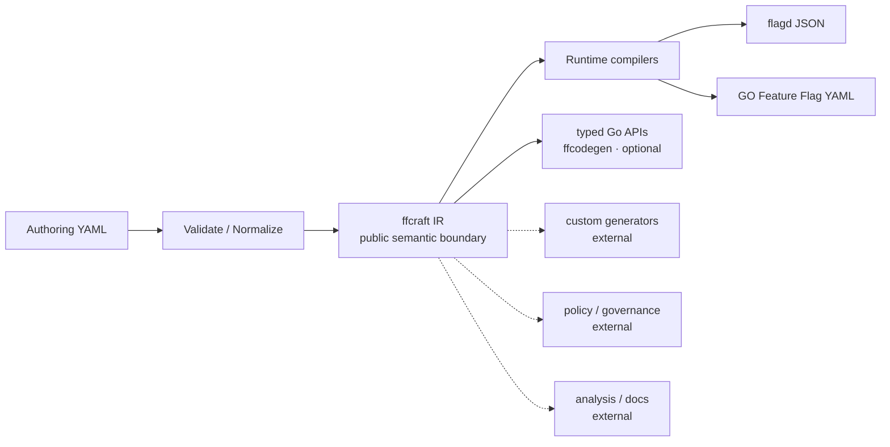
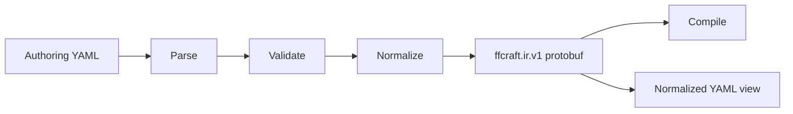

# ffcraft

ffcraft compiles portable feature flag definitions into runtime-specific
configuration.

It also exposes a normalized protobuf IR as a public semantic boundary for
compilers, generators, and other tooling. `ffcodegen`, included in this
repository, is an optional companion generator for typed Go APIs.

## Architecture


```mermaid
flowchart LR
    A[Authoring YAML] --> B[Validate / Normalize]
    B --> C[ffcraft IR<br/>public semantic boundary]

    C --> D[Runtime compilers]
    D --> D1[flagd JSON]
    D --> D2[GO Feature Flag YAML]

    C --> E[typed Go APIs<br/>ffcodegen · optional]

    C -.-> F[custom generators<br/>external]
    C -.-> G[policy / governance<br/>external]
    C -.-> H[analysis / docs<br/>external]
```

`ffcompile` validates and normalizes authoring definitions into the public
protobuf IR, then compiles that IR for supported runtimes. Solid arrows are
provided by this repository; dashed arrows show external tooling that can be
built on the public IR.

## Why ffcraft?

Feature flag definitions often need to be translated into provider-specific
configuration while preserving the same targeting, rollout, and environment
semantics.

Typed application APIs can optionally be generated from the same source
definition.

Keeping those representations synchronized by hand is error-prone and can
introduce semantic drift between environments, runtime providers, and
application code. `ffcraft` uses the authoring definition as the source of
truth and derives the downstream representations from it:

- one source of truth for flag definitions
- validation before deployment
- consistent semantics across supported runtime targets
- an extensible IR for custom tooling and generators

## Quick Start

### Install

```bash
go install github.com/satorunooshie/ffcraft/cmd/ffcompile@latest
```

Make sure your Go bin directory is on `PATH`.

### Define a feature flag

Create `ffcompile.yaml`:

```yaml
version: v1

variant_sets:
  boolean:
    on: true
    off: false

flags:
  - key: enable-new-home
    variant_set: boolean
    default_variant: off
    environments:
      prod:
        default_action:
          serve: on
```

### Generate runtime configuration

For flagd:

```bash
ffcompile build flagd \
  --in ffcompile.yaml \
  --env prod \
  --out prod.flagd.json
```

For GO Feature Flag:

```bash
ffcompile build gofeatureflag \
  --in ffcompile.yaml \
  --env prod \
  --out prod.goff.yaml
```

### Optionally generate typed Go APIs

Install the companion generator if you need application-facing typed APIs:

```bash
go install github.com/satorunooshie/ffcraft/cmd/ffcodegen@latest
```

```bash
ffcodegen go \
  --in ffcompile.yaml \
  --out featureflags_gen.go
```

The generated package exposes typed accessors and a small SDK-agnostic
`Client` interface. Runtime SDK integration stays in your infrastructure
layer:

```go
evaluator := featureflags.New(client)

enabled, err := evaluator.EnableNewHome(ctx)
```

The runtime adapter implements the generated `Client` interface, while the
generated `Evaluator` provides the application-facing API.

## Compiler Pipeline

The core processing pipeline is provided by `ffcompile`:


```mermaid
flowchart LR
    A[Authoring YAML] --> B[Parse]
    B --> C[Validate]
    C --> D[Normalize]
    D --> E[ffcraft.ir.v1 protobuf]

    E --> F[Compile]
    E --> G[Normalized YAML view]
```

The protobuf IR is the public semantic contract between normalization and
downstream compilers and generators. Most users can use `ffcompile build`
directly without interacting with the IR.

Opaque extensions are preserved through normalization and may be consumed by
external generators. See the [extension spec](docs/extension-spec.md) for the
public contract.

The canonical authoring schema lives at
[proto/ffcraft/v1/ffcraft.proto](proto/ffcraft/v1/ffcraft.proto), and the public
normalized IR lives at
[proto/ffcraft/ir/v1/normalized.proto](proto/ffcraft/ir/v1/normalized.proto).

## Supported Features and Targets

### Authoring format

The authoring format currently supports version `v1` and:

- reusable `variant_sets`, `rules`, and `distributions`
- per-environment configuration
- fixed serving with `serve`
- percentage distributions
- scheduled and progressive rollouts
- comparison, logical, collection, string, and semantic-version operators
- opaque extension namespaces

### Runtime targets

| Target | Output |
| --- | --- |
| `flagd` | flagd-compatible JSON |
| `gofeatureflag` | GO Feature Flag YAML |

### Optional companion tooling

| Tool | Output |
| --- | --- |
| `ffcodegen go` | typed Go accessors and evaluation types |

### Key semantic differences

`ffcraft` uses a common authoring model, but target runtimes do not always
provide identical primitives. `ffcraft` validates or lowers these differences
instead of silently changing the intended semantics.

| Capability | `flagd` | `gofeatureflag` |
| --- | --- | --- |
| Fixed serve | native | native |
| Percentage rollout | `fractional` targeting | native `percentage` |
| Progressive rollout | normalized into scheduled snapshots | consumes scheduled snapshots |
| Scheduled rollout | timestamp-based conditional chain | native `scheduledRollout` |
| Mixed stickiness within one flag | supported per action | rejected because bucketing is flag-scoped |

See [docs/compiler-targets.md](docs/compiler-targets.md) for detailed target
behavior and constraints.

## Commands

### Build runtime configuration

`build` performs the complete authoring pipeline:

```text
authoring YAML → parse → validate → normalize → compile → target configuration
```

```bash
ffcompile build flagd \
  --in flags.yaml \
  --env prod \
  --out flagd.json

ffcompile build gofeatureflag \
  --in flags.yaml \
  --env prod \
  --out flags.goff.yaml
```

To inspect the normalized representation while building:

```bash
ffcompile build flagd \
  --in flags.yaml \
  --env prod \
  --dump normalized.yaml
```

If some flags do not define the requested environment and should be skipped:

```bash
ffcompile build flagd \
  --in flags.yaml \
  --env prod \
  --allow-missing-env
```

### Normalize to the public IR

Normalize authoring YAML once to protobuf IR:

```bash
ffcompile normalize flags.yaml \
  --format protobuf \
  --out featureflags.ir.v1.pb
```

The normalized YAML representation is a deterministic, human-readable view of
the same semantic model:

```bash
ffcompile normalize flags.yaml --out normalized.yaml
```

### Compile from the public IR

Compile the same IR for different runtime targets:

```bash
ffcompile compile flagd \
  --in featureflags.ir.v1.pb \
  --env prod \
  --out flagd.json

ffcompile compile gofeatureflag \
  --in featureflags.ir.v1.pb \
  --env prod \
  --out flags.goff.yaml
```

`compile` accepts normalized protobuf IR. It does not accept authoring YAML or
normalized YAML.

### Generate application code with the optional companion tool

`ffcodegen` can consume authoring YAML or normalized protobuf IR when you need
typed application APIs:

```bash
ffcodegen go \
  --in flags.yaml \
  --config ffcodegen.yaml \
  --out featureflags_gen.go

ffcodegen go \
  --format protobuf \
  --in featureflags.ir.v1.pb \
  --out featureflags_gen.go
```

For customized package names, context types, accessors, and fallback variants,
see [docs/ffcodegen.md](docs/ffcodegen.md).

## Limitations

Currently, YAML aliases and anchors are not supported.

Target-specific restrictions may also apply. See
[docs/compiler-targets.md](docs/compiler-targets.md) for details.

Opaque extensions are preserved at document, flag, and environment scope.
Core compilers ignore namespaces they do not own. See the
[extension spec](docs/extension-spec.md) for transport limits and ownership
rules.

## Documentation

- [Authoring format](docs/authoring-format.md)
- [Compiler targets](docs/compiler-targets.md)
- [Go code generation](docs/ffcodegen.md)
- [Extension and IR contract](docs/extension-spec.md)
- [JSON Schema guide](schema/README.md)

## Examples

The [examples](examples) directory contains end-to-end examples for common use
cases:

- [basic](examples/basic): fixed serving
- [rule-targeting](examples/rule-targeting): targeting conditions and rules
- [scheduled-rollouts](examples/scheduled-rollouts): scheduled changes
- [progressive-rollouts](examples/progressive-rollouts): progressive rollout
- [extensions](examples/extensions): extension namespace ownership
- [go-codegen](examples/go-codegen): typed Go APIs and runtime adapters

## Development

When working from a local checkout, run the commands directly with Go:

```bash
go run ./cmd/ffcompile --help
go run ./cmd/ffcodegen --help
```

Regenerate the Go code-generation fixtures with:

```bash
make update-go-example
```

The project is licensed under the terms in [LICENSE](LICENSE).
